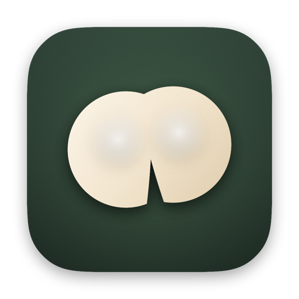
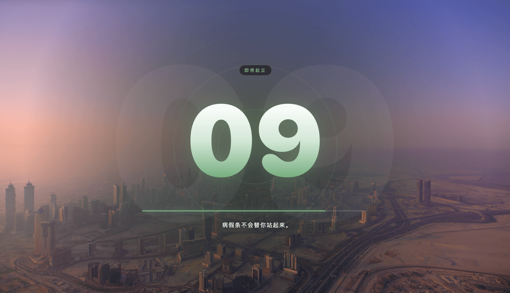
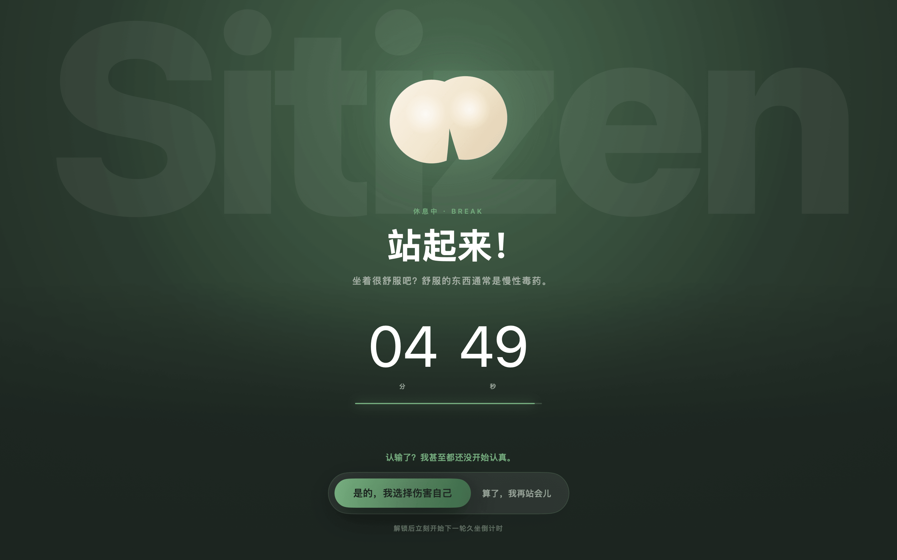
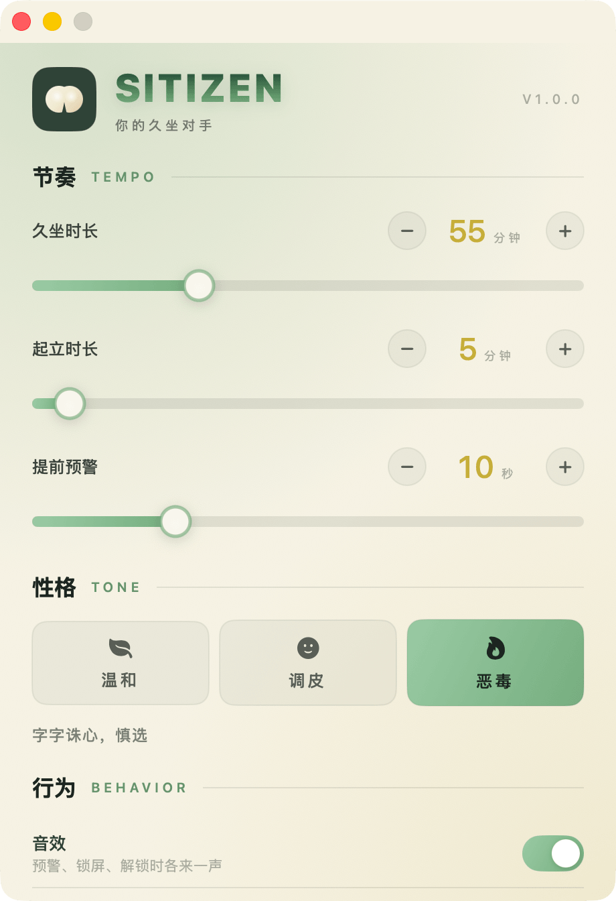

<div align="center">
  
  <h1>Sitizen</h1>
  <p><b>你的久坐对手</b> · 一个会让你的屁股和椅子分离的MacOS应用</p>
  <p>
    
    
    
    
  </p>
  <p>
    <a href="#安装">安装</a> ·
    <a href="#功能">功能</a> ·
    <a href="#开发">开发</a> ·
    <a href="#常见问题">常见问题</a>
  </p>
</div>

## 它是什么

你每天坐着的时间，大概率比躺着还长。

Sitizen 是一个常驻菜单栏的久坐提醒：**默认 45 分钟久坐 + 5 分钟起立**。时间一到，倒数最后 10 秒会在屏幕中央浮出一圈透明倒计时（不影响你操作任何东西），归零后直接锁脸——全屏覆盖、拦截快捷键，显示「站起来！」和本次休息的剩余时间，站够了才放行。

想提前坐回去也行，但要按两步：点「我投降」，再点一次确认。中间那句嘲讽是按你选的毒舌等级来的。

它没有 Dock 图标，不弹通知，不联网，没有第三方依赖。

---

## 功能

### 1. 最后十秒的全屏透明预警



数字浮在所有窗口之上，但鼠标点击**完全穿透**——不需要点它，也不会挡住你正在做的事。倒计时用等宽数字 + 定长两位（`10 → 09`），配合翻滚过渡，位数变化时不会有任何位移。深色和浅色壁纸上都验证过可读性。

### 2. 到点锁屏，站满了才放行



`.screenSaver` 层级、跨所有 Space、多显示器同时覆盖，并吞掉 ⌘ 组合键和 Esc。休息时间以「分 / 秒」两个大号数字块呈现。想认输要两步确认，也可以在设置里关掉认输（那样就只能站满）。

### 3. 节奏全由你定



## 安装

### 直接下载

从 [Releases](../../releases) 下载 `Sitizen-x.y.z.dmg`，双击打开，把 Sitizen 拖进 Applications。

> **第一次打开被拦下？**
> 因为没走 Apple 公证（需要付费开发者账号），Gatekeeper 会提示「无法验证开发者」。右键点击 App → 打开 → 再点「打开」即可，或者执行：
> ```bash
> xattr -dr com.apple.quarantine /Applications/Sitizen.app
> ```

### 装完没看到图标？

Sitizen 没有 Dock 图标，它住在菜单栏右上角。第一次启动会自动弹出设置窗口，之后：
- 点菜单栏上那个小图标 → 打开菜单
- 双击 Finder 里的 Sitizen → 弹出设置窗口

如果菜单栏图标被刘海挡住了，按住 ⌘ 拖动其他图标给它腾个位置。

---

## 开发

只需要 Xcode 命令行工具，不需要 `.xcodeproj`——整个项目是一个 Swift Package。

```bash
git clone https://github.com/leechan/sitizen.git
cd sitizen
make run          # 直接跑起来
```

### 常用命令

```bash
make help         # 列出所有目标
make run          # 本地调试运行
make build        # Debug 编译
make bundle       # 打包成 dist/Sitizen.app（通用二进制 + 签名）
make dmg          # 打包成带拖拽安装界面的 DMG
make install      # 打包并装到 /Applications 后启动
make selftest     # 跑一遍压缩后的完整节奏，验证状态机
```

### 开发辅助

```bash
make icon         # 重新生成 App 图标（由 App 自己渲染）
make preview      # 把各个界面渲染成 PNG 到 ./previews（设计走查）
make marketing    # 生成产品宣传图到 ./marketing
make snapshot     # 抓取真实浮层窗口的快照
```

这些都不是外部工具，而是 App 内置的开发模式：

```bash
Sitizen --selftest                          # 压缩到 14 秒跑完 久坐→预警→锁屏→起立
Sitizen --render-previews <目录>            # 离屏渲染各界面
Sitizen --render-appicon <目录>             # 渲染 .iconset
Sitizen --render-marketing <目录>           # 生成宣传图
Sitizen --render-dmg-background <路径> [缩放] # DMG 安装界面背景
Sitizen --snapshot <目录>                   # 抓取真实 AppKit 窗口
```

好处是设计稿和真实产品**永远一致**——宣传图、图标、DMG 背景都是从同一批视图渲染出来的，不存在「截图过期」的问题。

---

## 技术实现

**技术栈**：Swift Package（无可执行之外的依赖）· AppKit + SwiftUI 混合 · 最低 macOS 14

### 状态机

核心是 `AppState` 里的四态循环：`idle → sitting → warning → standing → sitting`。

计时用 **deadline 而非累减**（记录结束时间点，每次读 `timeIntervalSinceNow`），配一个 0.1 秒的 `Timer`。定时器挂在 `RunLoop.Mode.common` 上，这样菜单栏菜单展开、窗口拖拽时都不会停摆。

计时精确性由 deadline 保证，界面刷新只是显示——所以在 `make selftest` 里可以看到，即使中间有卡顿，倒计时也不会漂移。

### 透明浮层怎么做到不挡操作

预警窗口是一个无边框 `NSWindow`：`isOpaque = false`、`backgroundColor = .clear`、`ignoresMouseEvents = true`，且 `canBecomeKey` 返回 `false`——鼠标事件直接穿透到下层，也永远不会抢走焦点。

因为窗口是透明的，中心铺了一层径向暗底。不铺的话，用户开着一片白底文档时白色数字会直接消失。

### 锁屏怎么做到拦得住

锁屏窗口同样是无边框，但 `level = .screenSaver`（1000）、`collectionBehavior` 包含 `.canJoinAllSpaces` 和 `.fullScreenAuxiliary`，每块屏幕各一个窗口，并激活 App 拿到键盘焦点。键盘层面用 `performKeyEquivalent` 加 `NSEvent` 本地监听，吞掉所有 ⌘ 组合键和 Esc。

这是覆盖层而不是系统级锁屏——⌘Tab 仍然能切到别的 App（但浮层在所有 Space 之上不会消失），也不会出现「解不开」的情况。这是有意的取舍。

## 项目结构

```
Sources/Sitizen/
├── main.swift                  # 入口 + 开发模式分发
├── AppDelegate.swift           # 生命周期、单实例、设置窗口
├── AppState.swift              # 核心状态机（久坐/预警/起立）
├── SettingsStore.swift         # UserDefaults 配置
├── MenuBarController.swift     # 菜单栏图标与菜单
├── MenuBarIcon.swift           # 菜单栏剪影（template image）
├── OverlayCoordinator.swift    # 浮层窗口的创建与销毁
├── OverlayWindow.swift         # 无边框浮层窗口
├── SystemActivityWatcher.swift # 休眠 / 锁屏监听
├── SoundPlayer.swift           # 音效
├── LaunchAtLogin.swift         # SMAppService 开机启动
├── Copy.swift                  # 全部文案（三档毒舌）
├── Theme.swift                 # 深色主题色板
├── AppIconRenderer.swift       # 图标 / DMG 背景渲染
├── MarketingRenderer.swift     # 宣传图渲染
├── PreviewRenderer.swift       # 设计走查渲染
├── SelfTest.swift              # 状态机自检
└── Views/
    ├── WarningView.swift       # 最后十秒的透明预警
    ├── LockView.swift          # 锁屏
    ├── SettingsView.swift      # 设置页（浅色纸张主题）
    ├── Ambient.swift           # 设计系统组件
    ├── ButtMark.swift          # 图标标记
    └── MascotView.swift        # 椅子吉祥物（当前未使用）

scripts/
├── bundle.sh                   # 打包 .app
└── make-dmg.sh                 # 打包 DMG
```

约 4200 行 Swift，无第三方依赖。

---

## 常见问题

**它会不会偷偷联网？**
不会。没有任何网络代码，没有分析埋点，权限只用到「开机启动」。

**为什么 ⌘Tab 能切走？**
这是有意的。Sitizen 用的是覆盖层而不是系统级锁屏，目的是「你随时能走，但走了心里不舒服」，而不是把你锁在电脑前。

**为什么没有 Dock 图标？**
它是菜单栏工具。设置里也能看到当前状态。

**多显示器怎么表现？**
所有屏幕同时覆盖锁屏，但只有主显示器上有解锁按钮，其他屏显示「请到主显示器上解锁」。

**能改文案吗？**
可以，全在 `Sources/Sitizen/Copy.swift`，三个档位分开排列，往数组里加就行。

---

## 开源协议

[MIT](LICENSE) © 2026 夜漫长

---

## English

**Sitizen** is a macOS menu bar app that makes you stand up.

Default rhythm: **45 minutes sitting + 5 minutes standing**. Ten seconds before time's up, a fully transparent countdown appears at the center of the screen — it never intercepts your clicks. When it hits zero, the screen is covered by a lock overlay showing "站起来!" and the remaining break time. The only way out early is a two-step surrender button, followed by a taunt.

Built with Swift Package Manager, AppKit + SwiftUI, zero dependencies. macOS 14+.

```bash
make run      # build & run
make dmg      # build a drag-to-install DMG
make selftest # verify the state machine in 14 seconds
```

Licensed under [MIT](LICENSE).
